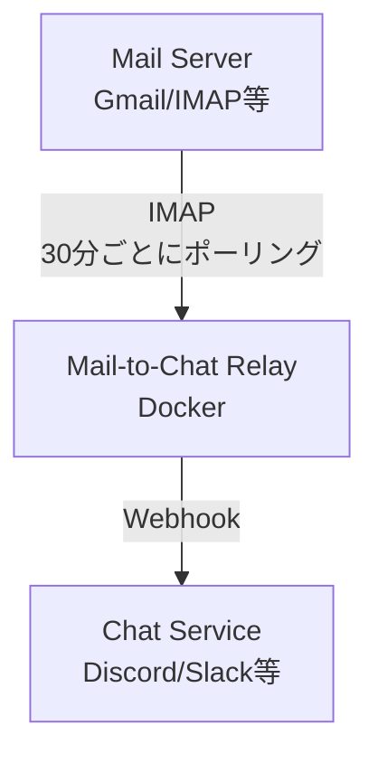

# Mail-to-Chat Relay 設計書

## 概要
メールを検知してチャットサービスに通知するプログラム。
特定の件名を持つメールを受信したら、Discordなどのチャットサービスに自動通知する。

## 要件

### 機能要件
- 特定条件のメールを検知（件名の前方一致など）
- チャットサービスに通知を送信
- 30分に1回メールボックスをチェック
- 過去一定時間内（デフォルト60分）に受信したメールのみを処理対象とする

### 非機能要件
- **保守性**: 拡張性を考慮した設計（将来的にSlack、LINE対応を容易に追加可能）
- **運用性**: 設定ファイルで動作を制御可能（コード変更不要）
- **可搬性**: Docker環境で動作（環境依存を最小化）

### 技術選定
- **実装言語**: Python 3.11+
- **実行環境**: Docker
- **実行方式**: 
  - Phase 1: cron（検証環境）
  - Phase 2: Google Cloud Run + Cloud Scheduler（本番環境）
- **設定管理**: YAML + 環境変数
- **通知方式**: Discord Webhook（Phase 1）、将来的にSlack、LINE対応

### 対応メールプロバイダ
- **Phase 1**: Gmail
- **Phase 2**: 独自サーバー（IMAP対応）

## アーキテクチャ

### システム構成


### ディレクトリ構造
```
mail-to-chat-relay/
├── src/
│   ├── mail/
│   │   ├── __init__.py
│   │   └── imap_client.py      # IMAPクライアント
│   ├── notifiers/
│   │   ├── __init__.py
│   │   ├── base.py              # 通知の基底クラス
│   │   └── discord_notifier.py  # Discord通知
│   ├── config.py                # 設定管理
│   └── main.py                  # エントリーポイント
├── config/
│   └── settings.yaml            # 設定ファイル
├── docs/
│   └── design.md                # 本ドキュメント
├── tests/
│   └── (テストコード)
├── infra/
│   ├── Dockerfile
│   ├── docker-compose.yml
│   └── crontab              # cronスケジュール設定
├── requirements.txt
├── .env.example
└── README.md
```

## 技術スタック

### 言語・ランタイム
- **Python**: 3.11+
- **Docker**: コンテナ化
- **cron**: スケジュール実行

### 主要ライブラリ
- `imaplib`: メール受信（標準ライブラリ）
- `email`: メール解析（標準ライブラリ）
- `requests`: Discord Webhook送信
- `pyyaml`: 設定ファイル読み込み
- `python-dotenv`: 環境変数管理
- `pytest`: テストフレームワーク（開発時のみ）

## データフロー

### メール処理フロー
```
1. cronによってスクリプトが30分ごとに起動
2. IMAPサーバーに接続
3. 過去60分以内に受信したメールを取得
4. 各メールに対して:
   a. 件名が設定したプレフィックスで始まるかチェック
   b. マッチした場合、チャットサービスに通知を送信
   c. メールを既読にする（重複防止の補助として）
5. 処理完了後、スクリプト終了
```

### 重複通知対策
- **主要な対策**: 過去一定時間内（デフォルト60分）のメールのみを処理対象とする
- **補助的な対策**: 通知後にメールを既読にすることで、万が一の重複を防ぐ
- **取りこぼし防止**: cron実行間隔（30分）より長い時間範囲（60分）を設定

## 設定仕様

### 設定管理の方針
- **環境変数(.env)**: 認証情報など機密情報を管理（Gitにコミットしない）
- **設定ファイル(settings.yaml)**: 動作設定を管理（Gitにコミット可能）

### 設定ファイル (config/settings.yaml)
```yaml
mail:
  host: imap.gmail.com
  port: 993
  check_period_minutes: 60  # 過去何分間のメールをチェックするか
  
filters:
  subject_prefix: "【重要】"  # 件名の前方一致条件

notifiers:
  discord:
    enabled: true
```

### cronスケジュール (infra/crontab)
```cron
# 30分ごとにメールチェック
*/30 * * * * cd /app && python src/main.py >> /var/log/mail-relay.log 2>&1
```

### 環境変数 (.env)
```
# メール認証情報
MAIL_USER=your-email@gmail.com
MAIL_PASSWORD=your-app-password

# 通知先
DISCORD_WEBHOOK_URL=https://discord.com/api/webhooks/...
```

**注意**: `.env`ファイルは機密情報を含むため、`.gitignore`に追加してGitにコミットしないこと

## クラス設計

### IMAPClient
**責務**: メールサーバーへの接続とメール取得

**主要メソッド**:
- `connect()`: IMAP接続
- `get_recent_emails(period_minutes)`: 指定期間内のメール取得
- `mark_as_read(email_id)`: 既読マーク（重複防止の補助）
- `disconnect()`: 接続切断

### BaseNotifier (抽象クラス)
**責務**: 通知機能の共通インターフェース

**主要メソッド**:
- `send(message)`: 通知送信（抽象メソッド）

### DiscordNotifier
**責務**: Discord Webhookへの通知送信

**主要メソッド**:
- `send(message)`: Discord Webhookに投稿

## ログ出力仕様

### ログレベル
- **INFO**: 通常の処理フロー（起動、接続、処理件数など）
- **WARNING**: 注意が必要な状態（接続リトライなど）
- **ERROR**: エラー発生時（接続失敗、通知失敗など）

### ログ出力内容
**出力する情報**:
- 処理開始・終了の日時
- IMAP接続・切断のタイミング
- チェックしたメール件数
- 通知を送信したメール件数
- エラー内容とスタックトレース

**出力しない情報（個人情報保護）**:
- メールアドレス（送信元・受信先）
- メール件名
- メール本文
- その他メールの具体的な内容

### ログ出力例
```
2025-12-03 10:00:01 INFO  [main] Processing started
2025-12-03 10:00:02 INFO  [imap] Connected to imap.gmail.com:993
2025-12-03 10:00:03 INFO  [imap] Found 5 emails in the last 60 minutes
2025-12-03 10:00:04 INFO  [filter] 2 emails matched the filter condition
2025-12-03 10:00:05 INFO  [notifier] Notification sent successfully (1/2)
2025-12-03 10:00:06 INFO  [notifier] Notification sent successfully (2/2)
2025-12-03 10:00:07 INFO  [imap] Disconnected
2025-12-03 10:00:08 INFO  [main] Processing completed
```

## セキュリティ考慮事項

### 認証情報の管理
- メールパスワード、Webhook URLは環境変数で管理
- `.env`ファイルは`.gitignore`に追加
- Gmailはアプリパスワードを使用（OAuth2は将来対応）

### 通信セキュリティ
- IMAP接続はSSL/TLS（ポート993）
- Discord WebhookはHTTPS

### プライバシー保護
- ログにメールアドレス、件名、本文などの個人情報を記録しない
- 処理件数や実行タイミングのみを記録

## 拡張性

### 将来的な拡張ポイント

#### 通知先の追加
`BaseNotifier`を継承して新しい通知クラスを作成:
- `SlackNotifier`: Slack通知
- `LineNotifier`: LINE Notify

#### フィルタ条件の拡張
- 送信元アドレスでのフィルタ
- 本文キーワードでのフィルタ
- 正規表現対応

#### メールプロバイダの追加
設定ファイルでホスト・ポートを変更するだけで対応:
- Outlook
- 独自メールサーバー

## テスト方針

### テスト対象
- **単体テスト**: 各クラスの主要メソッド
- **統合テスト**: メール取得から通知送信までの一連の流れ

### テスト方法
**単体テスト**:
- `IMAPClient`: モックを使用してIMAP接続をシミュレート
- `DiscordNotifier`: モックを使用してWebhook送信をシミュレート
- フィルタロジック: 実際の文字列でテスト

**統合テスト**:
- テスト用のメールアカウントとDiscord Webhookを使用
- 実際のメール送受信と通知をテスト（環境変数で切り替え可能）

### テストフレームワーク
- **pytest**: テストランナー
- **unittest.mock**: モック作成
- **pytest-cov**: カバレッジ測定

### テストケース例
```python
# IMAPClientのテスト例
def test_get_recent_emails():
    # 過去60分以内のメールを正しく取得できるか
    
def test_filter_by_subject():
    # 件名の前方一致フィルタが正しく動作するか
    
def test_mark_as_read():
    # メールを既読にできるか
```

### テスト実行
```bash
# 単体テストのみ
pytest tests/unit/

# 統合テスト（環境変数設定が必要）
pytest tests/integration/

# カバレッジ測定
pytest --cov=src tests/
```

## 運用

### Phase 1: 検証環境（cron）

**デプロイ**:
```bash
docker-compose up -d
```

**ログ確認**:
```bash
docker-compose logs -f
```

**設定変更**:
1. `config/settings.yaml`または`.env`を編集
2. コンテナを再起動: `docker-compose restart`

### Phase 2: 本番環境（Google Cloud Run）

**デプロイ**:
- Cloud Runにコンテナをデプロイ
- Cloud Schedulerで30分ごとにHTTPトリガー設定
- 環境変数はCloud Runの設定で管理

**必要な変更**:
- HTTPエンドポイント追加（Flask等で簡易API実装）
- main.pyを直接実行からHTTPハンドラー経由に変更

## 制限事項

### Phase 1の制限
- 通知記録の永続化なし（未読/既読のみで管理）
- Gmail専用（アプリパスワード必須）
- 件名の前方一致のみ対応
- Discord Webhookのみ対応

### 既知の課題
- メール処理中にプログラムが停止した場合、そのメールは次回チェック時に再処理される可能性あり
- チェック期間（60分）を超えて処理が遅延した場合、メールを取りこぼす可能性がある

## 参考情報

### Gmail設定
- IMAPを有効化: https://support.google.com/mail/answer/7126229
- アプリパスワード作成: https://support.google.com/accounts/answer/185833

### Discord Webhook
- Webhook URL取得: サーバー設定 > 連携サービス > Webhookを作成
